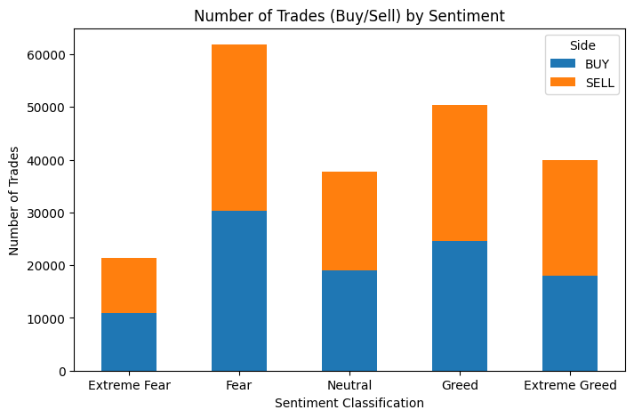
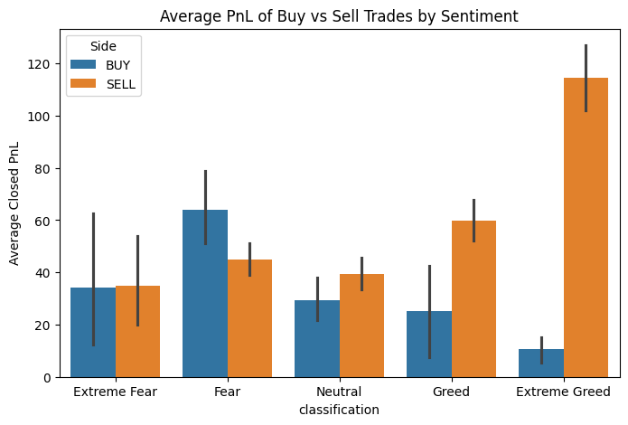
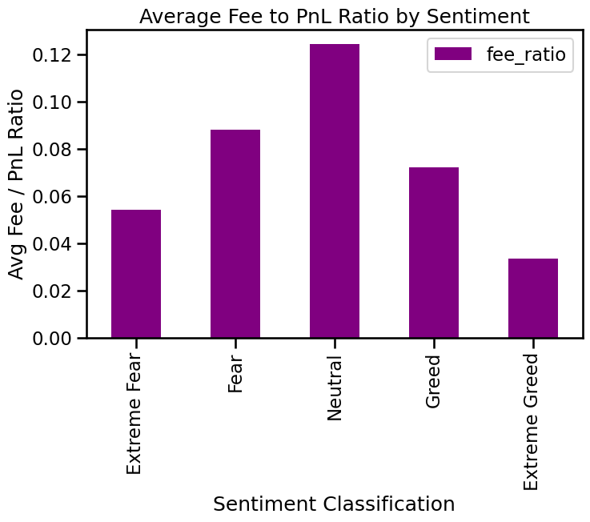
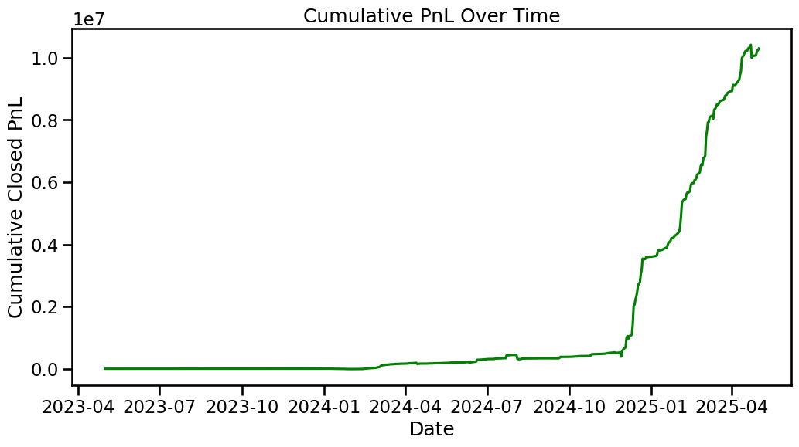
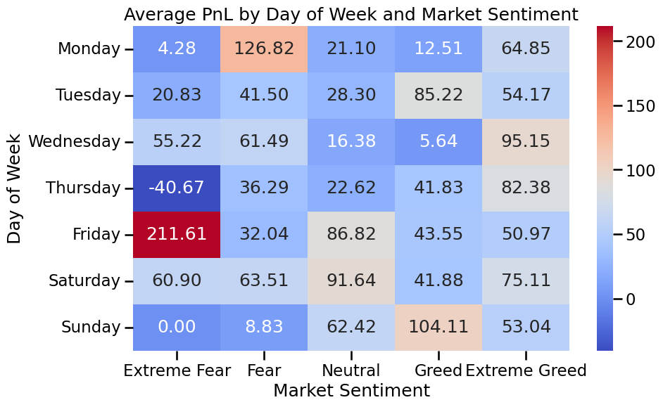

# 📊 Trader Behaviour vs Market Sentiment Analysis

## 📑 Overview
This repository contains an exploratory data analysis (EDA) examining the relationship between trader performance and market sentiment using historical data and Bitcoin's Fear-Greed Index.

The goal is to uncover behavioural patterns and deliver actionable insights for sentiment-aware trading strategies.

---------
## 📊 Datasets Used

- **Historical Trader Data**
  - Trade execution details like side (Buy/Sell), price, size, Closed PnL, start position, fees, etc.

- **Bitcoin Fear-Greed Index**
  - Daily sentiment classification into 5 categories:
    - `Extreme Fear`
    - `Fear`
    - `Neutral`
    - `Greed`
    - `Extreme Greed`

---

## 📈 Key Insights & Visualizations

### 📌 Market Sentiment Distribution  

> Most trades happen during **Fear** phases, indicating heightened activity in adverse markets.



---

### 📌 Win Rate by Sentiment  

| Sentiment       | Win Rate (%) |
|:----------------|:-------------|
| Extreme Fear     | 37.06        |
| Fear             | 42.08        |
| Neutral          | 39.70        |
| Greed            | 38.48        |
| Extreme Greed    | 46.49        |

- **Insight:** Higher win rates during `Extreme Greed`, confirming optimism improves trader performance.

---

### 📌 Directional Profitability (Buy vs Sell)  

> Buy trades outperform during **Greed**, while Sell trades perform relatively better in **Fear**.



---

### 📌 Fee Impact on Profitability  

> Fee-to-PnL ratio spikes in `Neutral` and `Fear` phases — indicating overtrading and thin margins during uncertain sentiment.

---

### 📌 Cumulative PnL Over Time  

> **PnL trends upward during Greed phases** and clusters losses in `Extreme Fear`.

---

## 📊 Statistical Test (T-Test)

**Question:** Are profits significantly higher on Greed days vs Fear days?

- **T-Statistic:** -1.851  
- **P-Value:** 0.064  

> **Interpretation:** Near-significant result suggesting better profitability on `Greed` days.

---

## 📅 Day of Week & Sentiment Heatmap

> Profitable trades cluster mid-week during Greed, while weekend trades tend to perform poorly under `Extreme Fear`.



---

## 📈 Final Recommendations

- Integrate Fear-Greed Index into trading models.
- Increase trade size and risk during `Greed` phases.
- Reduce activity during weekends and `Extreme Fear`.
- Monitor the fee-to-PnL ratio during volatile market moods.

---

## 📌 How to Run This Project

1️⃣ Clone this repository:
```bash
git clone https://github.com/Arin-Talavadekar/Trader-Behavior-Insights.git
cd Trader-Behavior-Insights
pip install -r requirements.txt


